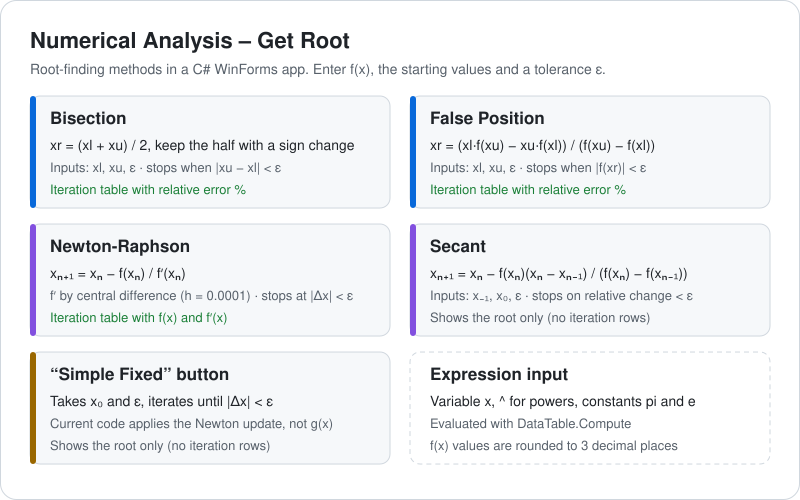

# Numerical Analysis – Get Root

A Windows Forms app in C# that finds a root of f(x) and shows each iteration in a table. I built it as numerical analysis coursework at university.

## Methods

- **Bisection**: inputs xl, xu and ε. The iteration table includes the relative error %.
- **False position (regula falsi)**: inputs xl, xu and ε. The iteration table includes the relative error %.
- **Newton-Raphson**: inputs x0 and ε. f′(x) comes from a central difference with h = 0.0001, and the table lists f(x) and f′(x).
- **Secant**: inputs x-1, x0 and ε. The app shows only the root, with no iteration rows.
- **"Simple Fixed"** button: it's in the UI, but the current code runs a Newton-style update instead of a separate g(x) iteration.

Type the equation with `x` as the variable, `^` for powers, and `pi` or `e` as constants, for example `x^3 - x^2 + 2`. The app evaluates it with `DataTable.Compute` and rounds values to 3 decimal places.

## Run

1. Open `Numerical Analysis.sln` in Visual Studio on Windows (.NET Framework 4.7.2, WinForms).
2. Restore the NuGet packages, then press F5.

If the build asks for `Numerical Analysis_TemporaryKey.pfx`, go to Project → Properties → Signing and clear "Sign the ClickOnce manifests". The key isn't committed to the repo.

---
Author: [Mostafa Ahmed (darsh-7)](https://github.com/darsh-7)
